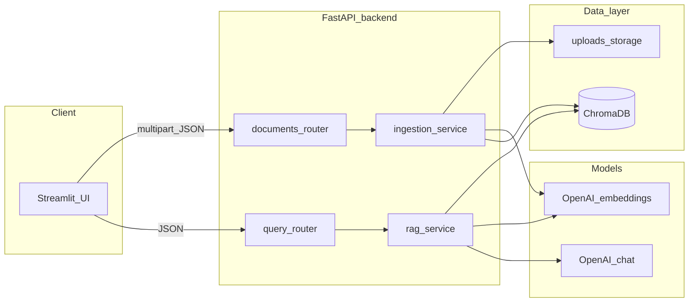

# AI Knowledge Assistant

**RAG** (retrieval-augmented generation) system: upload PDFs and text files, embed them into **ChromaDB**, and ask questions with answers **grounded in your documents** via the **OpenAI** API. A **FastAPI** backend exposes ingestion and Q&A; a **Streamlit** UI is a thin HTTP client over that API.

Modular RAG system with configurable retrieval (top-k) and grounded response generation to minimize hallucinations.

## Architecture



### Hallucination mitigation (design)

- **Prompting:** System instructions require answers only from the retrieved context; otherwise the model must say it cannot answer from the documents.
- **Source visibility:** API returns retrieved chunks (snippet, filename, doc id, score) so the UI can show **Sources**.
- **Retrieval:** Chunk overlap + configurable `MIN_RELEVANCE_SCORE` to drop weak matches.
- **Generation:** Low default temperature (`LLM_TEMPERATURE`).

## Quick start (local)

1. **Python 3.11+**

   ```bash
   cd /path/to/AI-Knowledge-Assistant-RAG-system
   python3 -m venv .venv
   source .venv/bin/activate   # Windows: .venv\Scripts\activate
   pip install -r requirements.txt
   ```

2. **Environment**

   ```bash
   cp .env.example .env
   # Edit .env and set OPENAI_API_KEY
   ```

3. **Run API** (from repo root, so `backend` is importable)

   ```bash
   uvicorn backend.main:app --reload --host 0.0.0.0 --port 8000
   ```

4. **Run UI** (second terminal)

   ```bash
   streamlit run frontend/app.py --server.port 8501
   ```

   Open http://localhost:8501 — ensure `API_BASE_URL` matches the API (default `http://localhost:8000`).

## Docker

```bash
cp .env.example .env
# Set OPENAI_API_KEY in .env
docker compose up --build
```

- API: http://localhost:8000  
- Streamlit: http://localhost:8501 (preconfigured with `API_BASE_URL=http://api:8000`)

Volumes persist Chroma data and uploaded files under `chroma_data` and `uploads` compose volumes.

## API

| Method | Path | Description |
|--------|------|-------------|
| `GET` | `/health` | Liveness + whether `OPENAI_API_KEY` is set |
| `POST` | `/documents` | Multipart file upload (`.pdf`, `.txt`, `.md`) |
| `GET` | `/documents` | List uploaded files (derived from stored filenames) |
| `POST` | `/query` | JSON `{"question": "...", "k": 8}` → answer + sources |

OpenAPI: http://localhost:8000/docs

## Configuration

See [.env.example](.env.example) for `EMBEDDING_MODEL`, `CHAT_MODEL`, chunk sizes, retrieval `k`, `MIN_RELEVANCE_SCORE`, and paths.

## Tests

```bash
pytest tests/ -v
```

Uses `FakeEmbeddings` + temporary Chroma directories and mocks the chat model where needed — **no live OpenAI calls**.

## Screenshots

### 1) Home and Navigation


### 2) Question and Answer


### 3) Sources with Chunk Metadata


### 4) Retrieved Context View


### 5) Tests


## Project layout

- [backend/main.py](backend/main.py) — FastAPI app and CORS  
- [backend/services/ingestion.py](backend/services/ingestion.py) — load, split, embed, upsert  
- [backend/services/retrieval.py](backend/services/retrieval.py) — similarity search + context assembly  
- [backend/services/rag.py](backend/services/rag.py) — grounded prompt + chat completion  
- [frontend/app.py](frontend/app.py) — Streamlit UI  
